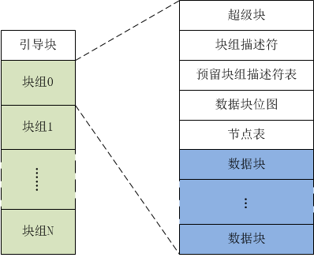

## 文件系统分类
- 磁盘文件系统，它是直接把数据存储在磁盘中，比如 Ext 2/3/4、XFS 等都是这类文件系统
- 内存文件系统，这类文件系统的数据不是存储在硬盘的，而是占用内存空间，我们经常用到的 /proc 和 /sys 文件系统都属于这一类，读写这类文件，实际上是读写内核中相关的数据数据
- 网络文件系统，用来访问其他计算机主机数据的文件系统，比如 NFS、SMB 等

## 磁盘
* 磁盘的最小管理单位是扇区(Sector:512B), 文件系统读写磁盘的单位是块(Block:4KB)。磁盘被格式化为三个区：
    - 超级块(superblock): 用来存储文件系统的详细信息，包括文件系统的格式、inode/block的总量、使用量、剩余量（块个数、块大小、空闲块等）
    - 索引节点区: 用来存储索引节点
    - 数据块区: 用来存储文件或目录数据

* EXT4文件系统的磁盘布局  
  

## 文件
* 「一切皆文件」是Linux的哲学，不仅普通的文件和目录， 字符设备、块设备、管道、socket、软链也都是以文件形式来组织。
* 在文件系统中，每个文件都包括两个重要的数据结构：索引项(index node)和目录项(directory entry)。
    - Inode:
        ```C++
        struct ext4_inode {
            __le16  i_mode;         /* File mode */
            __le16  i_uid;          /* Low 16 bits of Owner Uid */
            __le32  i_size_lo;      /* Size in bytes */
            __le32  i_atime;        /* Access time */
            __le32  i_ctime;        /* Inode Change time */
            __le32  i_mtime;        /* Modification time */
            __le32  i_dtime;        /* Deletion Time */
            __le16  i_gid;          /* Low 16 bits of Group Id */
            __le16  i_links_count;  /* Links count */
            __le32  i_blocks_lo;    /* Blocks count */
            __le32  i_flags;        /* File flags */
            ......
            __le32  i_block[EXT4_N_BLOCKS];/* Pointers to blocks */
            __le32  i_generation;   /* File version (for NFS) */
            __le32  i_file_acl_lo;  /* File ACL */
            __le32  i_size_high;
            ......
        };
        ```
