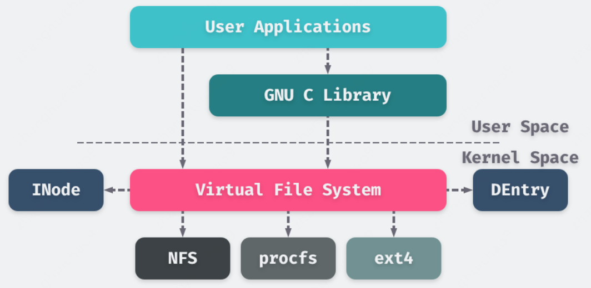

## VFS原理
VFS抽象了一个通用的文件系统模型，定义了通用文件系统都支持的抽象接口。新的文件系统只要支持并实现这些接口，并注册到Linux内核中，即可安装和使用。



## VFS组成
VFS抽象了四种对象类型:
- 超级块对象：代表一个已安装的文件系统
- 索引节点对象：代表具体的文件
- 目录项对象：代表一个目录项，是文件路径的一个组成部分
- 文件对象：代表进程打开的文件

## VFS结构
- 每个进程都有一个fd[]数组，里面每一项是指向struct file的指针（注：不同fd可以指向同一个file对象）
- struct file是内核中的数据结构，关联了真实文件和进程的映射; 当调用open()函数的时候，VFS会创建file对象，结构体如下：
```C++
struct file {
    struct path                   f_path;
    struct inode                  *f_inode;
    const struct file_operations  *f_op;
    unsigned int                  f_flags;
    fmode_t                       f_mode;
    loff_t                        f_pos;
    struct fown_struct            f_owner;
}

struct path {
    struct vfsmount  *mnt;
    struct dentry    *dentry;
}
```

