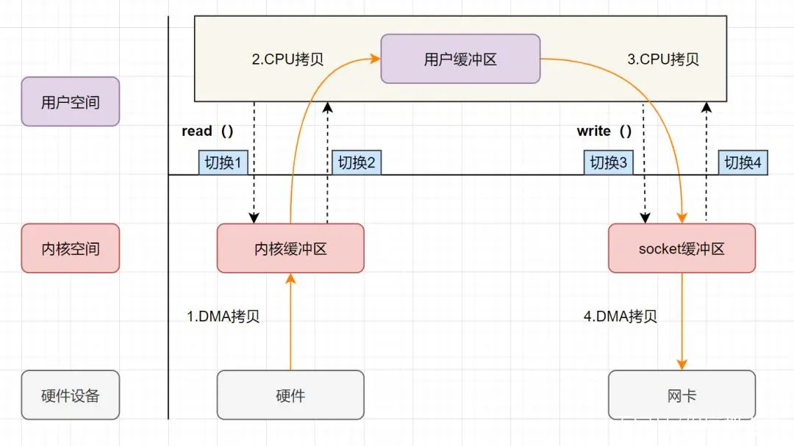
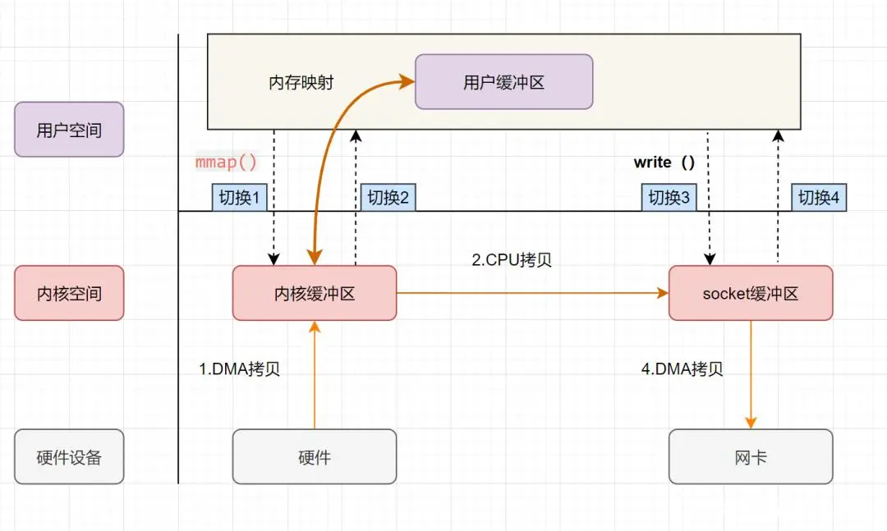
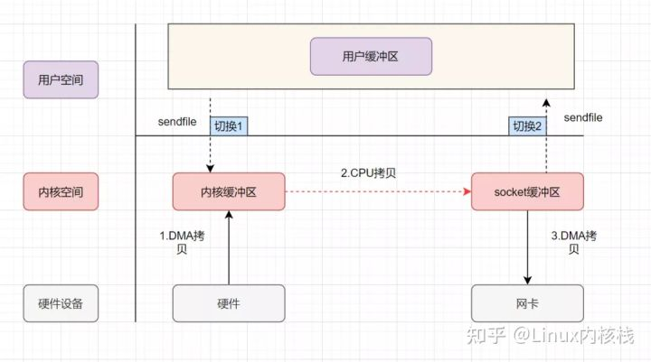

## 传统的拷贝

_如果你实现的是一个web程序，前端请求过来，服务端的任务就是：将服务端主机磁盘中的文件从已连接的socket发出去。关键实现代码如下：_  
```
while((n = read(diskfd, buf, BUF_SIZE)) > 0) //把数据从磁盘读到内核缓冲区，再拷贝到用户缓冲区
    write(sockfd, buf , n); //先把数据写到socket缓冲区，最后写入网卡设备
```
在没有任何优化技术使用的背景下，会进行 4 次数据拷贝、4 次上下文切换，如下图所示：
   

## 零拷贝技术  
#### mmap + write
在前面我们知道，read() 系统调用的过程中会把内核缓冲区的数据拷贝到用户的缓冲区里，write()系统调用再把用户缓冲区拷贝到内核的TCP缓冲区。为了减少这一步开销，可以用 mmap() 替换 read() 系统调用函数。mmap() 系统调用函数会直接把内核缓冲区里的数据「映射」到用户空间，这样操作系统内核与用户空间就不需要再进行任何的数据拷贝操作。
   

#### sendfile  
```
//参数：目的端文件描述符、源端文件描述符、源端的偏移量、复制数据的长度；
//返回值：实际复制数据的长度
ssize_t sendfile(int out_fd, int in_fd, off_t *offset, size_t count);
```
首先,它替代前面的 read() 和 write() 这两个系统调用，减少一次系统调用也就减少了 2 次上下文切换的开销。 其次，该系统调用，直接把内核缓冲区里的数据拷贝到 socket 缓冲区里，不再拷贝到用户态，这样就只有3 次数据拷贝。
   


可以看出如果没有优化，读取磁盘数据，再通过网卡传输的场景性能比较差：
#### 零拷贝技术
什么是零拷贝技术？   
> 零拷贝技术是一个思想[3]，指的是指计算机执行操作时，CPU 不需要先将数据从某处内存复制到另一个特定区域。

_可见，零拷贝的特点是 CPU 不全程负责内存中的数据写入其他组件，CPU 仅仅起到管理的作用。如果数据本身不在内存中，那么必须先通过某种方式拷贝到内存中（这个过程 CPU 可以仅仅负责管理，辅助硬件（如DMAC）来负责具体数据拷贝），才能被 CPU 直接读取计算。_  

零拷贝技术的具体实现方式有哪些？  
- DMA 技术：DMA 负责内存与其他组件之间的数据拷贝，CPU 仅需负责管理，而无需负责全程的数据拷贝；
使用 page cache 的 zero copy：
- sendfile：用户从磁盘读取一些文件数据后不需要经过任何计算与处理就通过网络传输出去，一次系统调用代替 read/write (两次)系统调用，通过使用 DMA 技术以及传递文件描述符，实现了 zero copy
- mmap：仅代替 read 系统调用，将内核空间地址映射为用户空间地址，write 操作直接作用于内核空间。通过 DMA 技术以及地址映射技术，用户空间与内核空间无须数据拷贝，实现了 zero copy
- Direct I/O：读写操作直接在磁盘上进行，不使用 page cache 机制，通常结合用户空间的用户缓存使用。通过 DMA 技术直接与磁盘/网卡进行数据交互，实现了 zero copy
