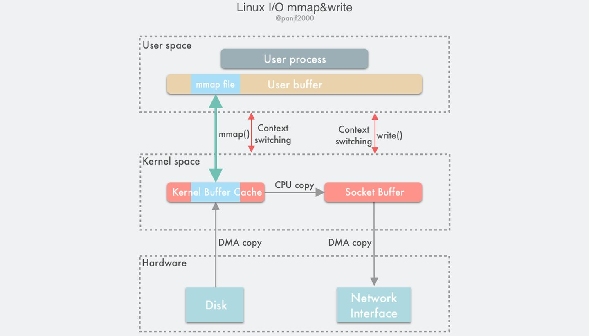

## Memory Map
mmap(memory map) 是一种内存映射文件的方法，即将一个文件(或其它对象)映射到进程的地址空间，实现文件磁盘地址和进程虚拟地址空间中一段虚拟地址的一一对映关系。实现这样的映射关系后，进程就可以采用指针的方式随机读写操作这一段内存，而系统会自动回写脏页面到对应的文件磁盘上，这样就替代了 `read()`、`write()` 等系统调用函数。内核空间对这段区域的修改也直接反映用户空间，从而可以实现不同进程间的文件共享。如下图所示：

#### mmap 的 I/O 模型

   

##### mmap 技术特点：
- 1. mmap 提供的内存空间是连续的虚拟空间（虚拟内存），而不是物理空间（物理内存），因此可以分配远大于物理内存限制的虚拟空间；
- 1. 利用 DMA 技术来取代 CPU 来在内存与其他组件之间的数据拷贝，例如从磁盘到内存，从内存到网卡, 读写单位是4KB(Page Size)；
- 2. mmap 由操作系统负责管理，对同一个文件地址的映射将被所有线程共享，操作系统确保线程安全以及线程可见性；
- 3. 用户空间的 mmap file 使用虚拟内存，实际上并不占据物理内存，只有在内核空间的 kernel buffer cache 才占据实际的物理内存；
- 4. mmap 仅仅能够避免内核空间到用户空间的全程 CPU 负责的数据拷贝，但是内核空间内部还是需要全程 CPU 负责的数据拷贝；
- 5. mmap() 函数需要配合 write() 系统调动进行配合操作，这与 sendfile() 函数有所不同，后者一次性代替了 read() 以及 write()；因此 mmap 也至少需要 4 次上下文切换；

##### 利用 mmap() 替换 read()，配合 write() 调用的整个流程如下：
- 1. 用户进程调用 mmap()，从用户态陷入内核态，将内核缓冲区映射到用户缓存区；
- 2. DMA 控制器将数据从硬盘拷贝到内核缓冲区（可见其使用了 Page Cache 机制）；
- 3. mmap() 返回，上下文从内核态切换回用户态；
- 4. 用户进程调用 write()，尝试把文件数据写到内核里的套接字缓冲区，再次陷入内核态；
- 5. CPU 将内核缓冲区中的数据拷贝到的套接字缓冲区；
- 6. DMA 控制器将数据从套接字缓冲区拷贝到网卡完成数据传输；
- 7. write() 返回，上下文从内核态切换回用户态。

#### mmap的优点：
- 1. 读写效率提高：避免内核空间到用户空间的数据拷贝  
- 2. 避免只读操作时的 swap 操作(当系统空间不足时可以直接淘汰)
- 3. 节约内存: 由于用户空间与内核空间实际上共用同一份数据，因此在大文件场景下在实际物理内存占用上有优势。
- 4. 简化用户编程模式：不用考虑页加载和淘汰（缺页异常懒加载），不考虑一致性（操作系统脏页回刷）

#### mmap的缺陷：
*mmap在相关场景下的性能存在缺陷：*  
- 1. 由于 mmap 使用时必须实现指定好内存映射的大小，因此 **mmap 并不适合变长文件**；
- 2. **不适合大量随机写**：如果更新文件的操作很多，最终还是落在了大量的脏页回写及由此引发的随机 I/O 上，所以这种情况下，mmap 方式在效率上不一定会比带缓冲区的一般写快；
- 3. 读/写小文件浪费内存空间：对于小于4K的文件，将文件调入到内存当中需要占用一个页4K(内存按页分配)，相当一部分内存空间浪费掉了；
- 4. mmap 受限于操作系统内存大小：例如在 32-bits 的操作系统上，虚拟内存总大小也就 2GB，无法对 超过2GB 大小的文件完全进行 mmap，在这种情况下你必须分多块分别进行 mmap，但是此时地址内存地址已经不再连续，使用 mmap 引入了额外的复杂性；

#### mmap的适用场景
*mmap 的适用场景实际上非常受限，在如下场合下可以选择使用 mmap 机制：*  
- 1. 多个进/线程以只读的方式同时访问一个文件(如动态链接库)，因此节约了内存；
- 2. 对同一块区域频繁读写操作，或连续追加写；
- 3. mmap 非常适合用于进程间通信，并可以依赖于操作系统的同步原语；
