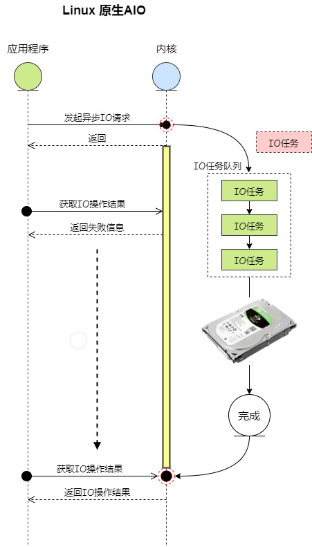

> 什么是异步 IO？  
> 异步 IO：当应用程序发起一个 IO 操作后，调用者不能立刻得到结果，而是在内核完成 IO 操作后，通过信号或回调来通知调用者。

## Linux 原生 AIO 原理  
   

#### Linux 原生 AIO 处理流程：
- 1. 当应用程序调用 `io_submit()` 系统调用发起一个异步 IO 操作后，会向内核的 IO 任务队列中添加一个 IO 任务，并且返回成功。
- 2. 内核会在后台处理 IO 任务队列中的 IO 任务，然后把处理结果存储在 IO 任务中。
- 3. 应用程序轮询 `io_getevents()` 系统调用来获取异步 IO 的处理结果，如果没完成返回失败信息，否则会返回 IO 处理结果。

#### Linux 原生 AIO 使用  
在介绍 Linux 原生 AIO 的实现之前，先通过一个简单的例子来介绍其使用过程：  
```
#define _GNU_SOURCE

#include <stdlib.h>
#include <string.h>
#include <libaio.h>
#include <errno.h>
#include <stdio.h>
#include <unistd.h>
#include <fcntl.h>

#define FILEPATH "./aio.txt"

int main() {
    io_context_t context;
    struct iocb io[1], *p[1] = {&io[0]};
    struct io_event e[1];
    unsigned nr_events = 10;
    struct timespec timeout;
    char *wbuf;
    int wbuflen = 1024;
    int ret, num = 0, i;

    posix_memalign((void **)&wbuf, 512, wbuflen);

    memset(wbuf, '@', wbuflen);
    memset(&context, 0, sizeof(io_context_t));

    timeout.tv_sec = 0;
    timeout.tv_nsec = 10000000;

    int fd = open(FILEPATH, O_CREAT|O_RDWR|O_DIRECT, 0644); // 1. 打开要进行异步IO的文件
    if (fd < 0) {
        printf("open error: %d\n", errno);
        return 0;
    }

    if (0 != io_setup(nr_events, &context)) {               // 2. 创建一个异步IO上下文
        printf("io_setup error: %d\n", errno);
        return 0;
    }

    io_prep_pwrite(&io[0], fd, wbuf, wbuflen, 0);           // 3. 创建一个异步IO任务

    if ((ret = io_submit(context, 1, p)) != 1) {            // 4. 提交异步IO任务
        printf("io_submit error: %d\n", ret);
        io_destroy(context);
        return -1;
    }

    while (1) {
        ret = io_getevents(context, 1, 1, e, &timeout);     // 5. 获取异步IO的结果
        if (ret < 0) {
            printf("io_getevents error: %d\n", ret);
            break;
        }

        if (ret > 0) {
            printf("result, res2: %d, res: %d\n", e[0].res2, e[0].res);
            break;
        }
    }

    return 0;
}
```
*在上面的例子中，我们获取异步 IO 操作的结果是在一个无限循环中进行的，其实 Linux 还支持一种基于 eventfd 事件通知的机制，可以通过 eventfd 和 epoll 结合来实现事件驱动的方式来获取异步 IO 操作的结果。*  

#### 一般来说，使用 Linux 原生 AIO 需要 3 个步骤：
- 1) 调用 io_setup 函数创建一个一般 IO 上下文。
- 2) 调用 io_submit 函数向内核提交一个异步 IO 操作。
- 3) 调用 io_getevents 函数获取异步 IO 操作结果。

Linux 原生 AIO 实现在源码文件 [/fs/aio.c](https://github.com/torvalds/linux/blob/master/fs/aio.c) 中。
